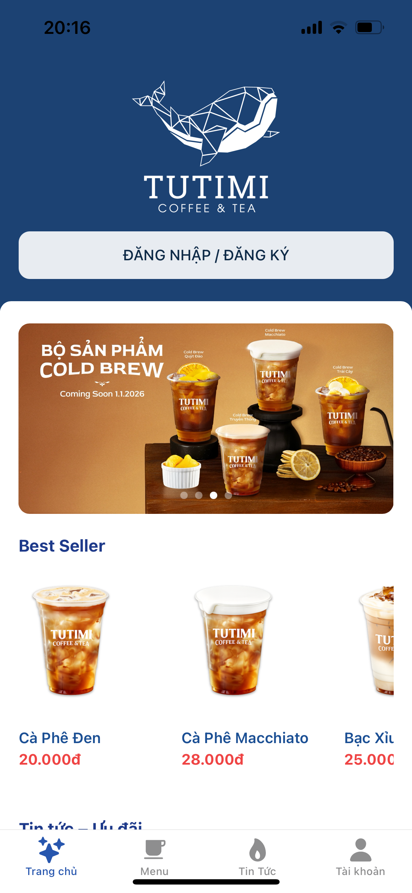
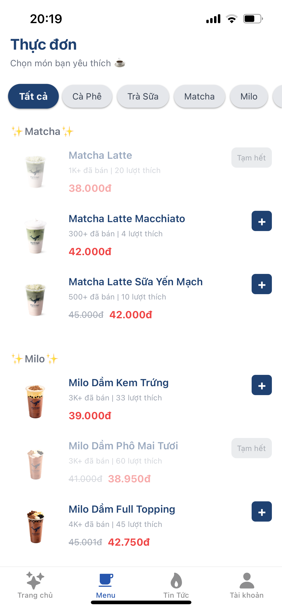

# ☕ TUTIMI Coffee & Tea App

> Mobile storefront with in-app admin CMS built using **React Native**, **Expo**, **TypeScript**, **Supabase** and **NativeWind**

🎬 Demo Videos (Tap icon to watch)

- [🔐](https://drive.google.com/file/d/10jDW6RcvfwlruKamahgt5aByfQ2Pw_yu/view) Signup Flow (OTP Verification + Set Password)
- [🛒](https://drive.google.com/file/d/14uYz3C_pYx09GCXaqdJyGtfaOYq0sner/view?usp=drive_link) Customer Journey: Browse Menu → Add to Cart → Place Order
- [📦](https://drive.google.com/file/d/15IWfKgCDY2buCUuG2zjG34kwmC5NQ9KH/view) Order Workflow: Confirm / Complete / Cancel
- [📴](https://drive.google.com/file/d/1B1kHhCzi7S0HGuSL0c2FoY7MX8HOi4Sl/view) Admin - Toggle Product Availability (On/Off + Toggle All)
- [🛠️](https://drive.google.com/file/d/1Rcx9DTd3y3rrBF08F4t4-diwhZPDHNwZ/view) Admin Dashboard Overview (In-App Admin Tools)

---

## 🎯 What This Is

A mobile ordering app for a coffee & tea shop, including both a customer storefront and in-app admin tools for daily operations.

**Customer features:** Browse menu, save favorites, use vouchers, manage profile, and read news with Home notifications.
**Admin features:** Toggle product/voucher availability, update theme/branding, and manage orders (confirm / complete / cancel).
Advanced permissions and large-scale management are handled via a separate web dashboard.

---

## 💼 Why This Matters

This project demonstrates:
- **End-to-end mobile development** from UI to backend integration
- **Real-world UX patterns** like swipe actions, loading states, and gesture handling
- **Clean architecture** with hooks, services, and proper separation of concerns
- **Production skills** including auth flows, image storage, and role-based access

Built by one developer to show readiness for frontend/mobile roles.

---

## 🛠️ Tech Stack

```
Frontend:  React Native + Expo + TypeScript + Nativewind
Backend:   Supabase (Auth + Database + Storage)
Routing:   Expo Router (file-based)
State:     React hooks + AsyncStorage
UI/UX:     Gesture handlers, animations, responsive layouts
```

---

## 📸 Application Screenshots

<table>
  <tr>
    <td width="50%" align="center">
      
      <br/>
      <strong>🏠 Home</strong>
      <br/>
      <em>Main interface with banners and product categories</em>
    </td>
    <td width="50%" align="center">
      
      <br/>
      <strong>📋 Menu</strong>
      <br/>
      <em>Product list with category-based filtering</em>
    </td>
  </tr>
  <tr>
    <td width="50%" align="center">
      
      <br/>
      <strong>🎨 Theme Customization</strong>
      <br/>
      <em>Change application theme and visual style</em>
    </td>
    <td width="50%" align="center">
      
      <br/>
      <strong>🛠️ Admin – Product Management</strong>
      <br/>
      <em>Admin dashboard for managing products</em>
    </td>
  </tr>
</table>

---

## ✨ Key Features

### Customer App
- Banner carousel with snap scrolling
- Category-filtered product menu (SectionList)
- Favorites system with real-time sync
- Voucher eligibility checking
- Theme customization

### Admin CMS
- Dashboard with animated stats
- Product management (CRUD + availability on/off)
- Voucher management (CRUD + active/inactive toggle)
- Order processing workflow (confirm / complete / cancel)
- Theme / branding customization
- Image upload via Expo ImagePicker + Supabase Storage
- Swipeable list actions for quick edits
- Role-gated access control

---

## 🏗️ Architecture Highlights

```
app/
  (tabs)/      → Customer-facing screens
  (admin)/     → Admin-only routes
  (auth)/      → Login/signup flows

hooks/         → Reusable logic (theme, branding)
services/      → Business rules (voucher eligibility)
lib/           → Supabase client config
```

**Design principles:**
- Business logic separated from UI components
- Explicit loading/error/empty states
- Layout-based routing for role separation
- Mobile-first responsive design

---

## 🚀 Quick Start

```bash
# Install dependencies
npm install

# Set up Supabase project and configure .env:
EXPO_PUBLIC_SUPABASE_URL=your_url
EXPO_PUBLIC_SUPABASE_ANON_KEY=your_key

# Run app
npx expo start
```

---

## 🎓 What This Demonstrates

✅ Mobile-first development with React Native/Expo  
✅ TypeScript for type-safe code  
✅ Backend integration (auth, database, storage)  
✅ Clean code architecture and separation of concerns  
✅ UX-focused interactions (gestures, animations, states)  
✅ Full-stack thinking (customer + admin flows)

---

**Built with ❤️ to showcase frontend mobile development skills**